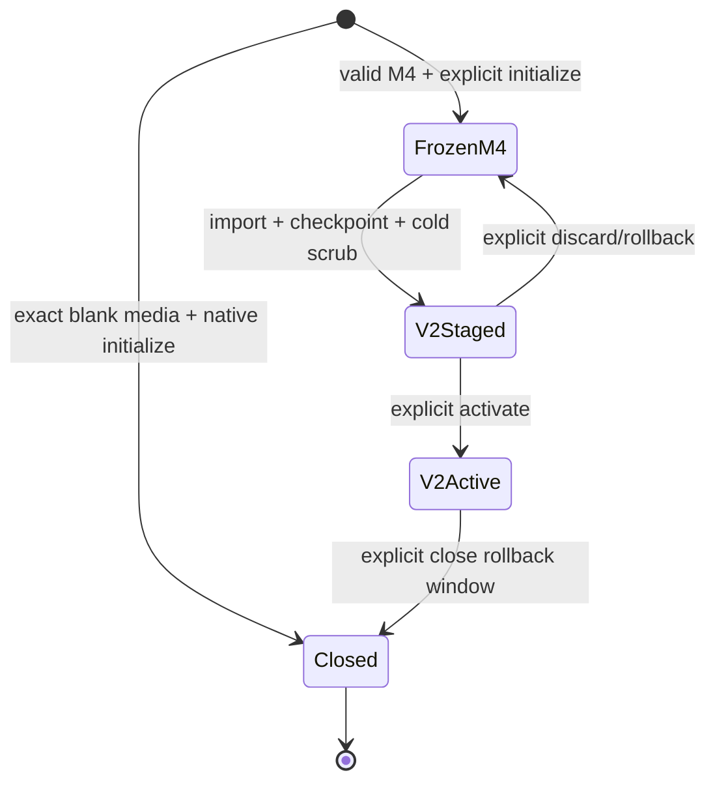

# Storage V2 migration and rollback contract

Storage V2 migration is an explicit maintenance operation. Discovering an M4
journal never authorizes an automatic import or a format. The migration code
recovers M4 through its strict decoder, applies the external root policy, writes
the admitted objects and authority snapshot into a disjoint Storage V2 range,
runs a cold scrub, and only then may change boot preference.

## Fixed ranges

All ranges are half-open 512-byte logical-block ranges on one stable device.

| Purpose | Range | During rollback window |
|---|---:|---|
| M4 journal | `[64, 576)` | frozen and read-only |
| migration control | `[576, 608)` | selector writes only |
| reserved | `[608, 2048)` | inaccessible |
| Storage V2 | `[2048, 67712)` | eight segments plus the 16-page anchor |

The control region is exactly four 4096-byte pages: slot A body/seal followed
by slot B body/seal. Its device capability must name `[576, 608)` exactly. A
relative-page adapter must not translate control I/O through the Storage V2
slice, whose page zero is absolute LBA 2048.

## Format probe

The boot probe has three results for each format: absent, valid, or corrupt.
It recognizes M4 only after the strict `VIBECAP` journal decoder accepts its
entire sealed chain, and recognizes Storage V2 only after both the immutable
superblock and selected checkpoint pass the production decoder and binding
checks. M4 follows its frozen append ABI: an unsealed sector is a permanently
ignored torn append and a later valid sector may chain around it; any sealed
malformed sector or chain/semantic violation is corrupt. Storage V2 likewise
ignores only its explicitly canonical publication prefixes. Corrupt and
conflicting sealed formats fail closed.

The selector additionally binds the stable device ID, both data ranges, the
Storage V2 store UUID, an activation-checkpoint floor, and the imported
authority snapshot's SHA-256 activation commitment. Device incarnations are
deliberately absent from disk because they change at restart; every online I/O
still uses the current session-bound block capability.

## State machine



`FrozenM4` selects M4 and contains no V2 publication fields. `V2Staged` still
boots M4 and exact-binds the current Storage V2 checkpoint and authority
snapshot produced by a healthy cold scrub. On the `V2Active` transition those
same fields become an immutable activation floor and commitment. The current
persistent-authority snapshot generation must be at least the floor, and
equality requires the exact committed authority digest. The physically selected
checkpoint may be newer than that snapshot: this is the expected crash/current-
boot state after a CAS Object was committed but before a later authority grant
named it. Such an Object remains anonymous and non-persistent. Boot accepts the
state only when the physical checkpoint is no older than the authority snapshot
and a full mount, exact external-policy recovery, and healthy full scrub all
succeed. Thus normal V2 writes remain possible after activation. The current
VIBECAS2 production writer and mount path publish a dense snapshot with zero
replay records; the frozen delta ABI is not yet an accepted M7.7 state.
`Closed` keeps the same floor semantics while
permanently selecting V2. Reclaiming M4 space is a later, separately authorized
operation and is not implied by closing the selector.

Native initialization is deliberately not migration. It is admitted only when
both strict probes report M4 absent and migration control absent. Before the
first V2 mutation the kernel freezes the shared legacy facade, drains it, and
revokes the private M4 writer. It then resumes only an exact prefix of the
canonical V2 format sequence, installs the exact empty `VIBEAUT2` authority at
checkpoint generation 2, cold-mounts and scrubs it, and publishes generation-1
`RollbackClosed`. The native store uses fixed UUID `VIBEOS-STOR-V2!!`; M4 stays
all-zero. A valid M4 journal still requires explicit migration, while a foreign,
partially noncanonical, or corrupt format fails closed instead of being erased.

Every transition requires `StoreMaintenance::ExplicitMaintenance`. The opaque
token is bound to the Storage V2 runtime, store UUID, stable device ID, and the
exact initial V2 block range. The controller also requires that runtime's
private, non-cloneable provisioner as a sealed domain witness. Online-only
`Grow`/`Scrub` authority, a revoked token, a token or provisioner from another
runtime, a token for a different device/range/store, a control record in the
wrong alternating slot, or a non-successor generation is rejected before I/O.
The initial `FreezeM4` invocation exact-checks the target V2 UUID against this
runtime authority even though the Frozen record keeps all V2 publication
fields zero. Rollback is explicit and cannot silently replace an active V2
generation.

The legacy operator shell exposes no automatic transition. `storage rollback`
is admitted only from `V2Staged`: it re-runs the complete V2 cold scrub and
production authority-policy validation, strictly rereads M4 under one fixed
device session, requires byte-for-byte equality between the canonical M4 and
V2 authority streams, and only then publishes `FrozenM4`. Rollback never
reopens the logical write gate or remints the revoked M4 writer; the selected
M4 journal remains read-only. `storage close-rollback` is admitted only from
`V2Active`: it re-runs the same V2 validation, preserves the immutable
activation floor, and publishes `RollbackClosed`. Both commands require the
same exact `StorageMigrationAuthority` lease as migration and execute as
boxed, one-shot SYSTEM workers. Retrying either command from any other state is
rejected rather than interpreted as an implicit transition.

## Publication and crash recovery

Each transition replaces the older alternating slot using the following
ordered durability protocol:

1. Clear the target seal, flush, reread, and require exact zero.
2. Write the canonical body and flush.
3. Write the canonical seal containing the body digest and terminal marker.
4. Flush, reread both pages, and decode the exact intended record.

The terminal marker is the publication point. Recovery ignores only an exact
zero seal, an exact prefix of the canonical seal write, or an exact prefix of
clearing the previous canonical seal. Arbitrary missing-marker bytes are
corruption. Every permitted strict prefix before the final seal leaves the
previous selector authoritative. After the terminal marker is durable,
recovery either selects the complete successor or fails closed on corruption;
it never guesses between two plausible authorities. When both slots are
sealed, each generation must occupy its prescribed alternating slot, and the
pair must be adjacent generations forming one allowed transition with
identical stable bindings.

The data-plane order is stronger than the selector order:

1. Prepare or strictly mount only the disjoint V2 slice.
2. Close the shared logical M4 write gate and drain the exact active facade
   claim, then publish `FrozenM4` and revoke the physical writer branch.
3. Strictly recover the frozen M4 journal.
4. Import only the externally admitted closure into `[2048, 67712)`, then
   publish and reread the Storage V2 checkpoint.
5. Run the full cold scrub, including object bytes, Blob roots, typed edges,
   allocation closure, persistent roots, and authority snapshot.
6. Publish `V2Staged`; M4 remains the boot preference.
7. Publish `V2Active` as a distinct durable transition within the same
   explicitly authorized operator request (or a later authorized retry).

Thus every interruption before V2 checkpoint and scrub completion leaves M4
authoritative, and every interruption after activation leaves a complete,
independently verifiable V2 publication.

## Powered-off verification

Run:

```sh
dd if=disk-before-migration.img of=unmanaged-prefix.bin bs=512 count=64
dd if=disk-after-final-legacy-boot.img of=frozen-m4.bin \
  bs=512 skip=64 count=512
python3 -B scripts/verify-storage-v2-migration.py \
  --unmanaged-prefix-baseline unmanaged-prefix.bin \
  --frozen-m4-baseline frozen-m4.bin disk.img
python3 -B scripts/verify-storage-v2-migration.py \
  --expect-native --unmanaged-prefix-baseline unmanaged-prefix.bin native.img
python3 -B scripts/verify-storage-v2-migration.py --selftest
```

The verifier is Rust-independent and emits a closed JSON schema. It runs the
independent strict M4 decoder and the frozen Storage V2 physical decoder, then
validates fixed range isolation, including byte-for-byte preservation of the
pre-migration unmanaged `[0, 64)` prefix supplied by the operator, both control
body/seal pairs, and byte-for-byte preservation of `[64, 576)` against the
baseline captured immediately after the final legacy boot and before the first
migration operation. Capturing it there prevents a migration write from being
blessed as rollback evidence. Every later Frozen, Staged, Active, and Closed
image must retain those exact bytes. The verifier also checks the exact V2
superblock range/device binding, activation-floor semantics, generation
adjacency, allowed transitions, and slot parity. It also performs the same
data-plane proof needed by cutover: allocation and authoritative-segment
closure, snapshot plus replay reconstruction, every manifest and canonical
Blob byte/Merkle tree, the `VIBEAUT2` authority payload and policy commitment,
exact stable-to-V2 object kind/commit bindings, exact object bytes, aggregate
principal quota totals, and absence of extra external roots. At the staged or
activation-floor checkpoint, the authority record stream and selected object
set must equal the retained M4 journal byte-for-byte; at a later active
checkpoint, the current authority stream must preserve the complete frozen M4
stream as an exact prefix. An authority-only GC relocation may advance the
authority generation with a zero-length logical extension and is reported as
`canonical_maintenance_relocation`; every non-empty suffix remains a strict
canonical extension. Such a suffix must preserve the production root policy:
it may contain canonical immutable objects, the exact allowed fixed-graph
grant/tombstone transitions, the exact saved-program state, and optional
sealed-singleton history. The resulting current stream is recovered under the
compiled policy and fully scrubbed. Structurally valid CAS mappings not named
by the authority binding table remain anonymous non-persistent leftovers: their
complete Blob bytes are still verified, but they acquire no root or lookup
authority.

Native mode additionally requires generation-1 `RollbackClosed`, the fixed V2
UUID, an all-zero M4 range, activation floor 2, the exact canonical empty
authority commitment, and a valid strict logical continuation from that empty
stream after ordinary writes.

The self-test covers every strict body/seal write prefix, every strict
seal-clear prefix, sealed corruption, wrong-slot records, partial publication,
writes to the unmanaged prefix, frozen M4 range, reserved gap, unmanaged suffix,
and an arbitrary-byte M4 probe. The Rust controller test covers Freeze, Stage,
Activate, Rollback, and Close at all six write/flush mutation boundaries under
not-submitted, volatile-ambiguous, durable-ambiguous, and three matching cancel
effects: 180 interrupted transitions which recover only the old or exact new
record. Separate matrices cover native format, empty-authority import, and
generation-1 Closed publication. Release acceptance drives one raw image through
seven powered-off migration boundaries and a separate blank image through two
native V2 boots. Every resulting state is checked by this verifier; the final
Closed boot also proves terminal rollback/close retries are rejected. The M4,
persistent-CSpace, Blob, and saved-program verifiers remain useful
independent cross-checks rather than substitutes for the migration proof.
